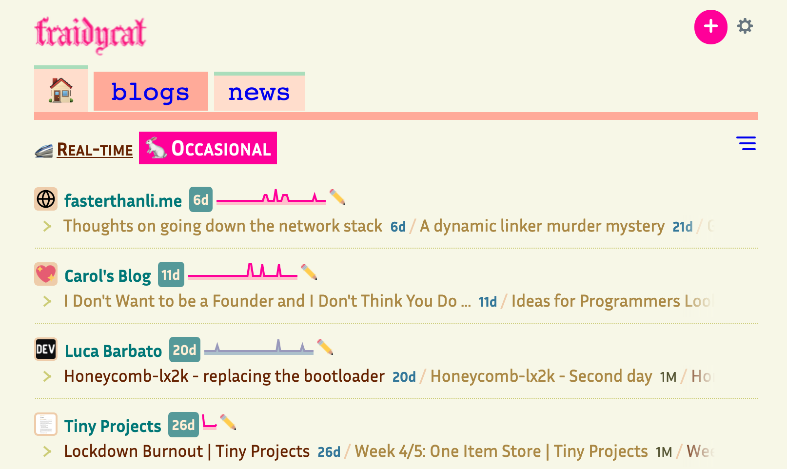

+++
title = "Surfing the internet like it's 2008"
date = 2020-07-29
+++

As time goes on I find myself trying to opt out of websites designed to keep my attention. It's difficult in this day and age but here's what I try to do.

[Single File Chrome](https://chrome.google.com/webstore/detail/singlefile/mpiodijhokgodhhofbcjdecpffjipkle?hl=en)

[Single File Firefox](https://addons.mozilla.org/en-US/firefox/addon/single-file/)

*Caption of fraidycat*

